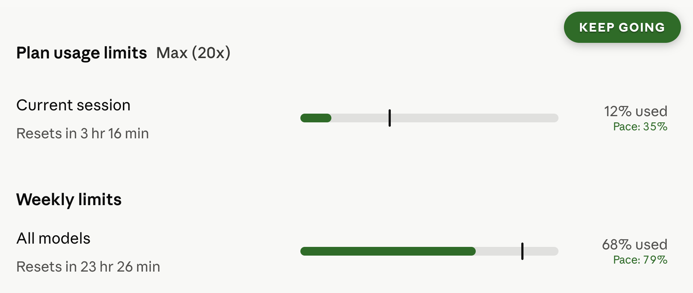

# Claude Usage Pace

Bro. You're paying for the sub. Are you actually **tokenmaxxing** it?

This is a tiny Chrome extension for the degens who treat every unused token
like a personal insult. It hijacks the progress bars on Claude's usage page
and recolors them based on whether you're **underfarming, perfectly pacing,
or about to get rate-limited into oblivion.** Bars that aren't tied to a
reset window get flattened to neutral grey.

The mission: **use 100% of your sub. Squeeze every drop. No quota survives.**

A little floating chip in the top-right is your pace coach:

- **KEEP GOING** (green) — you're underfarming. Send it. Refactor something.
  Generate more tests. Ask Claude to rewrite your README in the voice of a
  tokenmaxxing bro. Whatever it takes.
- **SLOW DOWN** (red) — you're burning faster than your window refills. Ease
  off or you're getting walled before the timer flips.

Green = printing. Red = cooked. Simple as.

## Install (unpacked)

1. Open `chrome://extensions`.
2. Flip **Developer mode** on (top-right).
3. Hit **Load unpacked** and point it at this folder.
4. Go to `https://claude.ai/settings/usage`. Bars recolor on load and
   re-sample every minute so your pace stays honest as time ticks.

Now go max that sub. Touch grass after.
